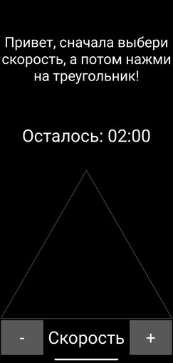
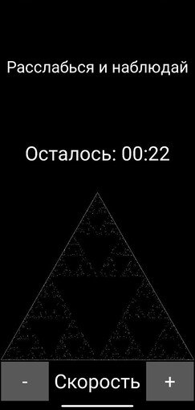
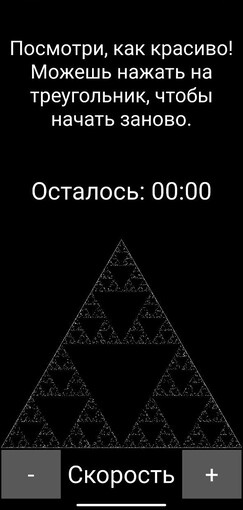

# Relaxing Triangle
Приложение для Android, создающее анимацию построения Треугольника Серпинского (методом Хаоса).

# Описание
Приложение “Relaxing Triangle” позволяет наблюдать за построением Треугольника Серпинского (методом Хаоса).  
Вы можете выбрать скорость построения и запустить анимацию, нажав на стартовый треугольник.

# Скриншоты
 
 

# Технические детали
- Язык программирования: Python
- Фреймворк: Kivy
- Платформа: Android

# Установка и запуск
## Установка приложения на Android
Скачайте apk-файл из директории [apk](apk) на устройство (с вертикальной ориентацией) с ОС Android.  
Для установки приложения Relaxing Triangle необходимо разрешить установку сторонних приложений на Android 

## Запуск приложения на Python
1. Клонируйте данный репозиторий.
2. Создайте виртуальное окружение и установите все необходимые зависимости, используя команду в терминале 
`pip install -r requirements.txt`
3. Запустите приложение с помощью `python main.py`.

# Основные виджеты:
- [Container](widgets/container/container.py): Основное окно приложения.
- [MessageWidget](widgets/message_widget/message_widget.py): Виджет, отображающий сообщения пользователю.
- [TimerWidget](widgets/timer_widget/timer_widget.py): Виджет обратного отсчета времени до завершения построения анимации.
- [GraphicWidget](widgets/graphic_widget/graphic_widget.py): Виджет графического окна построения анимации.
- [SpeedControl](widgets/speed_control/speed_control.py): Виджет выбора скорости анимации с помощью клавиш «-» и «+».
